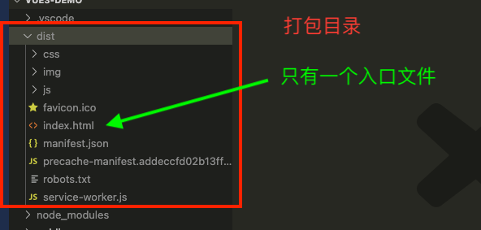

# 七.单页应用

::: tip 前言
SPA 单页面应用（SinglePage Web Application） ，指只有一个主页面的应用（一个 html 页面），一开始只需要加载一次 js、css 的相关资源。所有内容都包含在主页面，对每一个功能模块组件化。单页应用跳转，就是切换相关组件，仅仅刷新局部资源。
:::

- 创建一个 vue 项目，运行该项目，默认就是使用单页应用的配置。可以通过打包，查看打包文件，发现目录下只有一个 html 文件，不同页面都是通过 js 生成的，典型的单页应用。

  

  ::: details index.html 代码详情

  ```html {46-57}
  <!DOCTYPE html>
  <html lang="">
    <head>
      <meta charset="utf-8" />
      <meta http-equiv="X-UA-Compatible" content="IE=edge" />
      <meta name="viewport" content="width=device-width,initial-scale=1" />
      <!--[if IE]><link rel="icon" href="/favicon.ico"/><![endif]-->
      <title>vue3-demo</title>
      <link href="/js/about.a4d26817.js" rel="prefetch" />
      <link href="/css/app.a48831e5.css" rel="preload" as="style" />
      <link href="/js/app.9e52a425.js" rel="preload" as="script" />
      <link href="/js/chunk-vendors.c74864a9.js" rel="preload" as="script" />
      <link href="/css/app.a48831e5.css" rel="stylesheet" />
      <link
        rel="icon"
        type="image/png"
        sizes="32x32"
        href="/img/icons/favicon-32x32.png"
      />
      <link
        rel="icon"
        type="image/png"
        sizes="16x16"
        href="/img/icons/favicon-16x16.png"
      />
      <link rel="manifest" href="/manifest.json" />
      <meta name="theme-color" content="#4DBA87" />
      <meta name="apple-mobile-web-app-capable" content="no" />
      <meta name="apple-mobile-web-app-status-bar-style" content="default" />
      <meta name="apple-mobile-web-app-title" content="vue3-demo" />
      <link
        rel="apple-touch-icon"
        href="/img/icons/apple-touch-icon-152x152.png"
      />
      <link
        rel="mask-icon"
        href="/img/icons/safari-pinned-tab.svg"
        color="#4DBA87"
      />
      <meta
        name="msapplication-TileImage"
        content="/img/icons/msapplication-icon-144x144.png"
      />
      <meta name="msapplication-TileColor" content="#000000" />
    </head>
    <body>
      <noscript>
        <strong
          >We're sorry but vue3-demo doesn't work properly without JavaScript
          enabled. Please enable it to continue.</strong
        >
      </noscript>
      <!-- 可以看到和我们写的原生html页面不一样，这里的页面是用js渲染出来的 -->
      <div id="app"></div>
      <script src="/js/chunk-vendors.c74864a9.js"></script>
      <script src="/js/app.9e52a425.js"></script>
    </body>
  </html>
  ```

  :::

## 1.Router 配置

- 单页内部跳转并不会重新渲染 HTML 文件，其路由可以由前端进行控制，因此我们需要在项目内部编写相应的路由文件，Vue 会解析这些文件中的配置并进行对应的跳转渲染

  ```js{8,11,13}
  // router.js
  import Vue from "vue"
  import Router from "vue-router"
  import Home from "./views/Home.vue" // 引入 Home 组件
  import About from "./views/About.vue" // 引入 About 组件
  Vue.use(Router) // 注册路由
  export default new Router({
    //❓默认路由模式是 hash 模式，会携带 # 标记，与真实 url 不符，可以改为 history 模式
    routes: [
      {
        path: "/", // ❓如果路由存在二级目录，需要添加 base 属性，否则默认为 "/"
        name: "home",
        component: Home, // ❓页面组件没有进行按需加载，打包时和下面的一起打包成一个js文件，即使没有访问这个页面也会加载
      },
      {
        path: "/about",
        name: "about",
        component: About, // ❓页面组件没有进行按需加载
      },
    ],
  })
  ```

- 以上问题优化，但是需要注意页面渲染 404 的问题

  ```js{7,13,18}
  // router.js
  import Vue from "vue"
  import Router from "vue-router"
  Vue.use(Router)
  let base = `${process.env.BASE_URL}` // ✅
  export default new Router({
    mode: "history", // ✅ 使用history路由
    base: base,
    routes: [
      {
        path: "/",
        name: "home",
        component: () => import("./views/Home.vue"), // ✅ 按需加载组件，打包时会和下面的组件分开成2个js文件，当访问此资源才加载
      },
      {
        path: "/about",
        name: "about",
        component: () => import("./views/About.vue"), //✅ 按需加载组件
      },
    ],
  })
  ```

  :::tip 提示
    webpack 在编译时，会静态地解析代码中的 import，同时将模块添加到一个分开的 chunk 当中。这个新的 chunk 会被 webpack 通过 jsonp 来按需加载。

  如果你想给拆分出的文件命名，可以尝试一下 webpack 提供的 `Magic Comments`（魔法注释）：

  ```js
  const Home = () => import(/* webpackChunkName:'home'*/ "./views/Home.vue")
  ```
  :::

## 2.Vuex 配置

- Vuex 的配置文件

  ```js
  import Vue from "vue"
  import Vuex from "vuex"
  Vue.use(Vuex)
  export default new Vuex.Store({
    state: {},
    mutations: {},
    actions: {},
  })
  ```

  **我们可以通过 actions 异步提交 mutations 去 修改 state 的值并通过 getter 获取**。

- 中大型项目中为了后期的拓展性和可维护性，我们可以把它拆分为以下目录：

  ```bash
  └── store
      ├── index.js          # 我们组装模块并导出 store 的地方
      ├── actions.js        # 根级别的 action
      ├── mutations.js      # 根级别的 mutation
      └── modules
          ├── moduleA.js    # A模块
          └── moduleB.js    # B模块
  ```

- 与单个 store.js 文件不同的是，我们按模块进行了划分，每个模块中都可以包含自己 4 个核心功能。比如模块 A 中：

  ```js
  /* moduleA.js */
  const moduleA = {
    state: {
      text: "hello",
    },
    mutations: {
      addText(state, txt) {
        // 这里的 `state` 对象是模块的局部状态
        state.text += txt
      },
    },
    actions: {
      setText({ commit }) {
        commit("addText", " world")
      },
    },
    getters: {
      getText(state) {
        return state.text + "!"
      },
    },
  }
  export default moduleA
  ```

- 上方我们导出 A 模块，并在 index.js 中引入：

  ```js
  /* index.js */
  import Vue from "vue"
  import Vuex from "vuex"
  import moduleA from "./modules/moduleA"
  import moduleB from "./modules/moduleB"
  import { mutations } from "./mutations"
  import actions from "./actions"

  Vue.use(Vuex)

  export default new Vuex.Store({
    state: {
      groups: [1],
    },
    modules: {
      moduleA, // 引入 A 模块
      moduleB, // 引入 B 模块
    },
    actions, // 根级别的 action
    mutations, // 根级别的 mutations

    // 根级别的 getters
    getters: {
      getGroups(state) {
        return state.groups
      },
    },
  })
  ```

  这样项目中状态的模块划分就更加清晰，对应模块的状态我们只需要修改相应模块文件即可。

## 3.接口配置

- 在 src 目录下新建 services 文件夹用于统一管理接口文件

  ```sh
  └── src
      └── services
          ├── http.js      # 接口封装
          ├── moduleA.js    # A模块接口
          └── moduleB.js    # B模块接口
  ```

- 为了让接口便于管理，我们同样使用不同的文件来配置不同模块的接口，同时由于接口的调用 ajax 请求代码重复部分较多，我们可以对其进行简单的封装，比如在 http.js 中
  ::: details 详细代码

  ```js
  /* http.js */
  import "whatwg-fetch"

  // HTTP 工具类
  export default class Http {
    static async request(method, url, data) {
      const param = {
        method: method,
        headers: {
          "Content-Type": "application/json",
        },
      }
      if (method === "GET") {
        url += this.formatQuery(data)
      } else {
        param["body"] = JSON.stringify(data)
      }

      // Tips.loading(); // 可调用 loading 组件
      return fetch(url, param)
        .then((response) => this.isSuccess(response))
        .then((response) => {
          return response.json()
        })
    }
    // 判断请求是否成功
    static isSuccess(res) {
      if (res.status >= 200 && res.status < 300) {
        return res
      } else {
        this.requestException(res)
      }
    }
    // 处理异常
    static requestException(res) {
      const error = new Error(res.statusText)
      error.response = res
      throw error
    }
    // url处理
    static formatQuery(query) {
      let params = []
      if (query) {
        for (let item in query) {
          let vals = query[item]
          if (vals !== undefined) {
            params.push(item + "=" + query[item])
          }
        }
      }
      return params.length ? "?" + params.join("&") : ""
    }
    // 处理 get 请求
    static get(url, data) {
      return this.request("GET", url, data)
    }
    // 处理 put 请求
    static put(url, data) {
      return this.request("PUT", url, data)
    }
    // 处理 post 请求
    static post(url, data) {
      return this.request("POST", url, data)
    }
    // 处理 patch 请求
    static patch(url, data) {
      return this.request("PATCH", url, data)
    }
    // 处理 delete 请求
    static delete(url, data) {
      return this.request("DELETE", url, data)
    }
  }
  ```

  :::

- 请求示例

  ```js
  /* moduleA.js */
  import Http from "./http"

  export const getTestData = () => {
    return Http.get(【目标地址】)
  }
  ```

- 本地启动出现跨域，我们需要在 vue.config.js 中进行 devServer 的配置：

  ```js
  /* vue.config.js */
  module.exports = {
      ...
      devServer: {
          // string | Object 代理设置
          proxy: {
              // 接口是 '/repos' 开头的才用代理
              '/repos': {
                  target: 【目标地址】,
                  changeOrigin: true, // 是否改变源地址
                  // pathRewrite: {'^/api': ''}
              }
          },
      }
      ...
  }
  ```

## 4.公共配置

- 我们可以在 src 目录下建一个 common 文件夹来存放其配置文件

  ```bash
  └── src
      └── common
          ├── index.js      # 公共配置入口
          ├── validate.js   # 表单验证配置
          └── other.js      # 其他配置
  ```

- 在入口文件中我们可以向外暴露其他功能配置的模块

  ```js
  /* index.js */
  import Validate from "./validate"
  import Other from "./other"

  export { Validate, Other }
  ```

::: tip 总结
通过对单页应用的认识，相关 Router、Vuex 的配置，服务请求的封装，公共文件的配置，我们可以很清晰地认识到一个标准的单页应用在开发时需要注意的一些常见问题。
:::
