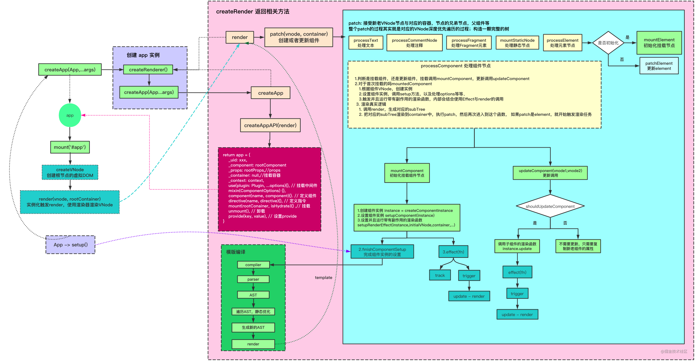

# 源码概览

::: tip 前言
此处 vue3.x 源码分析使用的版本是`3.2.31`
:::

```js
`main.js `                   |   `vue3.x`
                             |         2.createRenderer
import App from './App.vue'  |          /          \
                             |         /            \
                             |        /              \
1.createApp(App) <--------   |   3.createAppAPI        8.render   -->  9.patch[派发更新]
    |                        |         |                                 |
    |                        |    |- - - - - - - - - - - - - |           |
4.app.use        <--------   |    | 5.use                    |           |-- element
    |                        |    | provide                  |           |-- text
    |                        |    | inject                   |           |-- fragment
6.app.mount      <--------   |    | 7.mount  -->  8.render   |           |-- common
- - - - - - - - - - - - - - -|    |- - - - - - - - - - - - - |           |-- 10.component[组件类型]
<template>{{ a }}</template> |                                                /          \
<script>                     |                                               /            \
export default {             |                                             11.mount          update
  14.setup() {                  |                                               |
    const a = 0              |                                        |- - - - - - - - - - -|
  },                         |                                        |12.createInstance    |  App.vue[setup]       [组件数据]                             [组件模板]
}                            |                                        |13.setupComponent   -->  14.setup --> 15.finishSetupComponent --> 16.compiler  --> 8.render
</script>                    |                                        |17.setupRenderEffect --> 18.trigger                                     |
                             |                                        |- - - - - - - - - - -|                                             |- - - - - -|
`App.vue`                    |                                                                                                            | 1.parse   |
                             |                                                                                                            | 2.ast     |
                             |                                                                                                            | 3.gencode |
                             |                                                                                                            |- - - - - -|

```

<xminder tipkey="b"/>



## 源码调试

- 下载 vue3.x

```sh
git clone https://github.com/vuejs/core
```

- 开启 source map 模式

```json
// package.json
...
    "dev": "node scripts/dev.js --sourcemap",
...
```

- 打包

```
npm run dev
```

- 使用 live-server(需安装 vscode 插件) 打开 examples 目录下的 demo 文件

用户使用 vue3.x

```js
// main.js
const app = createApp(App)
app.use(ElementPlus, { locale })
app.mount("#app")
```

## 流程概述

createApp 会在内部通过执行 createRenderer 函数返回一个对象

```js
{
  render,
  createApp:createAppApi(render)
}
```

createApp(App)实际上就是执行

```js
createAppApi(App)
```

返回一个对象

```js
{
  use:相关函数,
  mount:相关函数,
  ...
}
```

执行 mount，会依次将根节点生成 vnode,然后调用上述 render 函数

render 函数通过 patch 将递归遍历整个项目节点，根据不通类型进入不通函数处理

如果是组件节点，会通过创建组件实例-->设置组件实例（期间会调用 setup 函数）-->完成组件实例的设置后查看是否需要编译-->设置并运行带有副作用的渲染函数-->通过 effect 的 update 调用 render 函数

上述组件在是否需要编译的地方如果需要编译，会通过 compiler 函数依次执行 parse --> ast -\_> gencode --> render 函数

通过上述递归方式将所有组件通过 render 函数渲染一边后，就能实现 vue3.x 的整个运行流程
